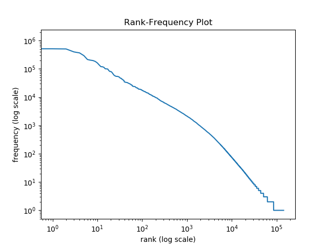

Homework 01: Getting our Feet Wet
================

# Part 1: Reading some data

### 1\. Your program

`01a_download-files.py`  
`01b_decompress-serialize.py`

### 2\. Sample terminal output, showing perhaps the first 100 lines of its output.

`Mainland Chinese Foreign Minister Qian Qichen was highly skeptical of
Tokyo's explanations of the content of the newly published US-Japan
guidelines for defense cooperation when he met Monday in Beijing with
representatives of Japan's press. Qian also said the time is not ripe
yet for a trilateral official dialogue among Washington, Beijing and
Tokyo on defense, adding that "scholarly discussion" would be
appropriate at the present. Qian's remarks indicate that despite
explanations of the new guidelines by Japanese Prime Minister Ryutaro
Hashimoto and Foreign Minister Keizo Obuchi, Beijing is still very
worried about whether Taiwan falls within the sphere of the bilateral
defense agreement. According to reports in the Japanese media, among
Qian's concerns are: -- If the defense pact is a matter between
Washington and Tokyo, it should be unnecessary to renew it, hence
putting its content into doubt. -- Although the new guidelines do not
specifically mention geographic criteria, there is still speculation
that they cover Taiwan. -- Some have argued for raising the transparency
of the bilateral agreement, while others advocate keeping it ambiguous
and opaque. The American Chamber of Commerce (AmCham) in Taipei on
Wednesday appealed for an early conclusion of trade consultations
between the United States and the Republic of China on terms for Taiwan
to join the World Trade Organization (WTO). AmCham President Jeffrey R.
Williams told a news conference that all AmCham members hope bilateral
ROC-US WTO talks will be concluded as soon as possible to facilitate
Taiwan's entry to the Geneva-based world trade regulatory body.
According to Williams, most American business people with interests in
Taiwan are convinced that they will benefit from Taiwan's WTO accession
because Taiwan would be required to further open its market and better
protect intellectual property rights. Williams, who just returned from a
"doorknocking" visit to Washington, D.C. at the head of a 12-member
AmCham delegation, said the US executive branch agreed with AmCham that
Taiwan's WTO accession should not be linked to mainland China's
membership application. "We agree that Taiwan's WTO entry should be
considered completely on the basis of its own economic conditions,"
Williams said, adding that Taiwan is likely to conclude WTO-related
trade consultations with the United States before the end of bilateral
WTO talks between Washington and Beijing. During its stay in the United
States, the AmCham delegation met with many Clinton administration
officials and Congress members to exchange views on ways to help
American corporations upgrade their overseas competitiveness. Williams
said the AmCham mission had urged various US federal agencies to allow
their senior officials to make frequent visits to Taiwan to help boost
bilateral trade and economic cooperation for mutual benefits. Even
though the Clinton administration was busy preparing for mainland
Chinese President Jiang Zemin's planned visit to the United States late
this month, Williams said, many federal government officials still
showed keen interest in listening to AmCham's suggestions and opinions
about reinforcing Taipei-Washington trade and economic ties. As to the
AmCham 1997-98 Taiwan White Paper, which he formally unveiled at a news
conference held in Washington, D.C. last Thursday, Williams said the
annual report mainly analyzed Taiwan's current economic and investment
climate as a reference for American companies intending to invest in
Taiwan, adding that the White Paper was not aimed at criticizing any
party. The White Paper said Taiwan's restrictions on trade and
investment across the Taiwan Strait have not only hindered the
development of its own industries but have also discouraged
multinational business groups from setting up a foothold on the island.
It further claimed that the ROC government's master plan to develop
Taiwan into an Asia-Pacific operations center would remain a pipe dream
if Taiwan companies are not allowed to enter the vast mainland market
directly and obtain access to its resources. Williams said AmCham's
analysis was made purely from a commercial viewpoint, adding that AmCham
members believe Taiwan must establish direct communications and
transport links with mainland China so that Taiwan-based companies can
make successful inroads into the world's largest market. Evergreen's
green-colored ships and green matchbox-like containers are the hope of
the port of Gioia Tauro in southern Italy. Taiwan-based Evergreen Marine
Corp., which operates one of the largest container fleets in the world,
is wagering on Gioia Tauro, a newly-developed and non-urban port area,
attempting to build it into the third largest container port in the
world. Evergreen is also targeting Gioia Tauro as a gateway to all
Mediterranean-rim states and the Black Sea to the north, said a company
spokesman. The Italian government has put up nearly US$180 million
since 1975 to develop the quiet backwater fishing port into a commercial
harbor. With most parts of the development already finished, the harbor
accommodated some 1,270 ships in the first six months of this year. The
harbor bureau there estimated that its transshipment capacity may
reach 1.4 million TEUs this year. Although the port is fully
operational, its peripheral facilities are still in dire need of help,
Aldo Alessio, mayor of Gioia Tauro, lamented. He noted that many support
works have been left unfinished due to budget constraints, with highways
in the vicinity only four meters wide and the nearby hinterland
remaining undeveloped and blanketed by weeds. Taipei's representative
office in Rome, which has generally been reluctant to beckon Taiwan
investors to Italy for fear that the European country's labor union
clout and chronically inefficient bureaucracy may hinder their
development, has championed Evergreen's container port project in Gioia
Tauro. Joe Hung, Taipei representative in Italy, said Evergreen made the
right decision by choosing Gioia Tauro. As long as there is no major
strike problem, chances for the project's success are great, he said,
noting that the port of Gioia Tauro is strategically positioned and has
the full support of the Italian government. While Evergreen's arrival in
Gioia Tauro brings hope to people in southern Italy, the move also
stimulates Taiwan investors to look toward Italy, enabling them to have
other choices beyond mainland China, Southeast Asia and Latin America,
Hung said. Taiwan should be treated the same as all 17 other members in
meetings of the Asia-Pacific Economic Cooperation (APEC) forum even if
the gatherings are held in Beijing, Taipei's arch rival, said P.K.
Chiang, chairman of the Council for Economic Planning and Development
(CEPD), on Wednesday. Chiang made the remarks in an interpellation
session before the Legislative Yuan's Economic Affairs Committee, during
which Legislator Yen Chin-fu of the opposition Democratic Progressive
Party asked him what Taiwan would do if Beijing sponsors the 2001 APEC
meeting and demands that Taiwan take part in the gathering as a local
economic entity of the People's Republic of China. Chiang said it is
still too early to speculate on who will host the 2001 APEC meeting.
Taiwan, a full APEC member, has taken part in all eight APEC
ministerial-level meetings in the past as a sovereign economic entity
with a status equal to that of every other APEC member, Chiang said.
"Things didn't change in the past and they won't change in
the`

### 3\. A sentence or two describing your approach and any bugs you encountered

I ended up downloading the files in a python script with `BeautifulSoup`
from `bs4` and `wget`. I decompressed and serialized the files in a
separate script using `gzip` and `etree` from `lxml`. I’ve only parsed
an .xml file once or twice beforehand so there was a lot of trial and
error before I figured out something that worked the way I wanted it to.
I kept the file contents in a nested list and then flattened the list of
extracted text to output a single string.

# Part 2: Structuring the data

### 1\. How many sentences are there in the CNA-GW corpus?

579,780

# Part 3: Counting and Comparing

### 1\. How many unique types are present in this corpus?

n types: 143,465

### 2\. How about unigram tokens?

n tokens:
16,674,709

### 3\. Produce a rank-frequency plot (similar to those seen on the Wikipedia page for Zipf’s Law) for this corpus

<!-- -->

### 4\. What are the twenty *most common* words?

THE, TO, OF, AND, IN, A, THAT, TAIWAN, ’S, SAID, FOR, ON, WILL, WITH,
IS, AT, AS, BY, HE,
BE

### 5\. You may notice that the most common are words that occur very frequently in the English langauge (stopwords). What happens to your type/token counts if you remove stopwords using `nltk.corpora`’s `stopwords` list?

n tokens: 10,293,408  
n types: 143,327

### 6\. After removing stopwords, what are the 20 most common words?

TAIWAN, ’S, SAID, CHINA, PERCENT, GOVERNMENT, ALSO, CHEN, PRESIDENT,
YEAR, TAIPEI, NT, TWO, MAINLAND, PEOPLE, US, NEW, CHINESE, ACCORDING,
PARTY

### 7\. Recalling Emily Bender’s sage advice - “Look at your data\!” - examine the 30 highest-PMI word pairs, along with their unigram and bigram frequencies. What do you notice?

The top 30 bigrams all appear to have the same PMI value as well as the
same p(w1,w2), p(w1), and p(w2) values.

| (w1,w2)                       |      pmi | p(w1,w2) | p(w1) | p(w2) |
| :---------------------------- | -------: | -------: | ----: | ----: |
| (‘HANNES’, ‘FARLEITER’)       | 18.65371 |    5e-07 | 1e-07 | 1e-07 |
| (‘FREIE’, ‘DEMOKRATISCHE’)    | 18.65371 |    5e-07 | 1e-07 | 1e-07 |
| (‘CEP006’, ‘10-03-97’)        | 18.65371 |    5e-07 | 1e-07 | 1e-07 |
| (‘NICOSIA’, ‘GORGIE’)         | 18.65371 |    5e-07 | 1e-07 | 1e-07 |
| (‘GORGIE’, ‘MURADOV’)         | 18.65371 |    5e-07 | 1e-07 | 1e-07 |
| (‘CAUSUS’, ‘BELLI’)           | 18.65371 |    5e-07 | 1e-07 | 1e-07 |
| (‘HARDCOVER’, ‘GILT-EDGED’)   | 18.65371 |    5e-07 | 1e-07 | 1e-07 |
| (‘FAYEZ’, ‘ZAWARNEH’)         | 18.65371 |    5e-07 | 1e-07 | 1e-07 |
| (‘CEP002’, ‘10-07-97’)        | 18.65371 |    5e-07 | 1e-07 | 1e-07 |
| (‘NN1’, ‘NN2’)                | 18.65371 |    5e-07 | 1e-07 | 1e-07 |
| (‘TULAGA’, ‘MANUELLA’)        | 18.65371 |    5e-07 | 1e-07 | 1e-07 |
| (‘LUCILLE’, ‘ROYBAL-ALLARD’)  | 18.65371 |    5e-07 | 1e-07 | 1e-07 |
| (‘HALLDOR’, ‘ASGRIMSSON’)     | 18.65371 |    5e-07 | 1e-07 | 1e-07 |
| (‘WAHYO’, ‘DJATMIKO’)         | 18.65371 |    5e-07 | 1e-07 | 1e-07 |
| (‘FLAVONOID’, ‘SPONIN’)       | 18.65371 |    5e-07 | 1e-07 | 1e-07 |
| (‘ZCCZ’, ‘CEP007’)            | 18.65371 |    5e-07 | 1e-07 | 1e-07 |
| (‘CEP007’, ‘10-10-97’)        | 18.65371 |    5e-07 | 1e-07 | 1e-07 |
| (‘FRIEDRICH’, ‘NAUMANN’)      | 18.65371 |    5e-07 | 1e-07 | 1e-07 |
| (‘ANDRIS’, ‘AMERIKS’)         | 18.65371 |    5e-07 | 1e-07 | 1e-07 |
| (‘GERMANIC’, ‘MANHOOD’)       | 18.65371 |    5e-07 | 1e-07 | 1e-07 |
| (‘ZAIMAN’, ‘NURMATIAS’)       | 18.65371 |    5e-07 | 1e-07 | 1e-07 |
| (‘ESTRADE’, ‘OYUELA’)         | 18.65371 |    5e-07 | 1e-07 | 1e-07 |
| (‘TOFILAU’, ‘ETI’)            | 18.65371 |    5e-07 | 1e-07 | 1e-07 |
| (‘STEPAN’, ‘KERKYASHARIAN’)   | 18.65371 |    5e-07 | 1e-07 | 1e-07 |
| (‘ARY’, ‘MARDJONO’)           | 18.65371 |    5e-07 | 1e-07 | 1e-07 |
| (‘MESUT’, ‘YILMAZ’)           | 18.65371 |    5e-07 | 1e-07 | 1e-07 |
| (‘SIX-CYLINDER’, ‘6.8-LITER’) | 18.65371 |    5e-07 | 1e-07 | 1e-07 |
| (‘BACRE’, ‘WALY’)             | 18.65371 |    5e-07 | 1e-07 | 1e-07 |
| (‘AFTERTAX’, ‘WRITEDOWN’)     | 18.65371 |    5e-07 | 1e-07 | 1e-07 |
| (‘HISAO’, ‘KANAMORI’)         | 18.65371 |    5e-07 | 1e-07 | 1e-07 |

### 8\. Experiment with a few different threshold values, and report on what you observe

I calculated PMI with threshold values of 20, 60, 100, and 200. I
included the top 10 highest-PMI word pairs and their unigram and bigram
frequencies below. As I raised the threshold value the top 10
highest-PMI values decreased, with a PMI of about 15.5 for a threshold
of 10 and a PMI of about 13 for a threshold of 200. Some categories of
word pairs that showed up in the top 10 things such as countries/cities
(e.g. Kuala Lumpur, Saudi Arabia, Las Vegas, Abu Dhabi), Latin phrases
(e.g. ad hoc, bona fide, alma mater), companies (e.g. Evertrust Rehouse,
AU Optronics), and politicians (e.g. Eric Liluan, Qian Qichen). As I
increased the threshold value I started to recognize more of the word
pairs. At a threshold of 10 one of the top word pairs was (“JENN”,
“LANN”). After googling, I learned that it is probably referring to
the Dajia Jenn Lann Temple in Taiwan (it’s appearance makes sense since
this data is from a Taiwanese newspaper). At a threshold of 60 and 100,
one of the top word pairs was (“BOVINE”, “SPONGIFORM”), a.k.a mad cow
disease. Interestingly, (“MAD”, “COW”) appears in the top word pairs
when the threshold is set to 200.

**Threshold of 10:**

| (w1,w2)                  |      pmi | p(w1,w2) |   p(w1) |   p(w2) |
| :----------------------- | -------: | -------: | ------: | ------: |
| (‘BONA’, ‘FIDE’)         | 15.56266 | 9.50e-06 | 1.3e-06 | 1.3e-06 |
| (‘IRIAN’, ‘JAYA’)        | 15.47565 | 9.50e-06 | 1.3e-06 | 1.4e-06 |
| (‘JENN’, ‘LANN’)         | 15.43483 | 9.50e-06 | 1.5e-06 | 1.3e-06 |
| (‘DISTAL’, ‘ILEUM’)      | 15.39561 | 1.18e-05 | 1.6e-06 | 1.6e-06 |
| (‘EVERTRUST’, ‘REHOUSE’) | 15.20945 | 1.14e-05 | 1.6e-06 | 1.7e-06 |
| (‘BUENOS’, ‘AIRES’)      | 15.18797 | 1.41e-05 | 1.9e-06 | 1.9e-06 |
| (‘JOHNS’, ‘HOPKINS’)     | 15.18335 | 1.23e-05 | 1.7e-06 | 1.9e-06 |
| (‘KRAFT’, ‘NABISCO’)     | 15.15720 | 1.41e-05 | 2.0e-06 | 1.9e-06 |
| (‘YUEN’, ‘FOONG’)        | 15.07019 | 1.14e-05 | 1.8e-06 | 1.8e-06 |
| (‘KAI-’, ‘SHEK’)         | 15.06065 | 1.32e-05 | 1.9e-06 | 2.0e-06 |

**Threshold of
60:**

| (w1,w2)                          |      pmi | p(w1,w2) |   p(w1) |   p(w2) |
| :------------------------------- | -------: | -------: | ------: | ------: |
| (‘MERRILL’, ‘LYNCH’)             | 14.30990 | 3.13e-05 | 4.1e-06 | 4.6e-06 |
| (‘ABU’, ‘DHABI’)                 | 14.29700 | 3.31e-05 | 4.7e-06 | 4.4e-06 |
| (‘LAS’, ‘VEGAS’)                 | 14.23374 | 3.41e-05 | 4.9e-06 | 4.6e-06 |
| (‘KOFI’, ‘ANNAN’)                | 14.02917 | 3.04e-05 | 4.1e-06 | 5.9e-06 |
| (‘SPONGIFORM’, ‘ENCEPHALOPATHY’) | 13.98079 | 4.77e-05 | 6.4e-06 | 6.4e-06 |
| (‘MODUS’, ‘VIVENDI’)             | 13.96931 | 4.45e-05 | 6.1e-06 | 6.2e-06 |
| (‘SHUI-’, ‘BIAN’)                | 13.96027 | 4.00e-05 | 5.3e-06 | 6.5e-06 |
| (‘ARAB’, ‘EMIRATES’)             | 13.77375 | 3.63e-05 | 7.0e-06 | 5.4e-06 |
| (‘YING-’, ‘JEOU’)                | 13.75340 | 5.49e-05 | 7.6e-06 | 7.7e-06 |
| (‘BOVINE’, ‘SPONGIFORM’)         | 13.74219 | 4.68e-05 | 7.9e-06 | 6.4e-06 |

**Threshold of
100:**

| (w1,w2)                          |      pmi | p(w1,w2) |    p(w1) |    p(w2) |
| :------------------------------- | -------: | -------: | -------: | -------: |
| (‘SPONGIFORM’, ‘ENCEPHALOPATHY’) | 13.98079 | 4.77e-05 | 6.40e-06 | 6.40e-06 |
| (‘YING-’, ‘JEOU’)                | 13.75340 | 5.49e-05 | 7.60e-06 | 7.70e-06 |
| (‘BOVINE’, ‘SPONGIFORM’)         | 13.74219 | 4.68e-05 | 7.90e-06 | 6.40e-06 |
| (‘ALMA’, ‘MATER’)                | 13.72335 | 5.09e-05 | 8.20e-06 | 6.80e-06 |
| (‘SRI’, ‘LANKA’)                 | 13.64812 | 5.95e-05 | 8.80e-06 | 8.00e-06 |
| (‘KUALA’, ‘LUMPUR’)              | 13.32089 | 9.17e-05 | 1.24e-05 | 1.22e-05 |
| (‘SAO’, ‘TOME’)                  | 13.25036 | 8.54e-05 | 1.27e-05 | 1.18e-05 |
| (‘AU’, ‘OPTRONICS’)              | 13.19092 | 7.36e-05 | 1.30e-05 | 1.06e-05 |
| (‘ERIC’, ‘LILUAN’)               | 13.16715 | 6.31e-05 | 1.43e-05 | 8.50e-06 |
| (‘QIAN’, ‘QICHEN’)               | 13.12408 | 5.54e-05 | 1.50e-05 | 7.40e-06 |

**Threshold of
200:**

| (w1,w2)                     |      pmi |  p(w1,w2) |    p(w1) |    p(w2) |
| :-------------------------- | -------: | --------: | -------: | -------: |
| (‘KUALA’, ‘LUMPUR’)         | 13.32089 | 0.0000917 | 1.24e-05 | 1.22e-05 |
| (‘SAUDI’, ‘ARABIA’)         | 13.07346 | 0.0000958 | 1.55e-05 | 1.30e-05 |
| (‘AD’, ‘HOC’)               | 12.67990 | 0.0001258 | 2.36e-05 | 1.66e-05 |
| (‘BURKINA’, ‘FASO’)         | 12.67976 | 0.0001739 | 2.31e-05 | 2.34e-05 |
| (‘MAD’, ‘COW’)              | 12.58397 | 0.0001471 | 2.05e-05 | 2.46e-05 |
| (‘NAUTICAL’, ‘MILES’)       | 12.47608 | 0.0001535 | 2.09e-05 | 2.81e-05 |
| (‘POUND’, ‘STERLING’)       | 12.35094 | 0.0002220 | 3.20e-05 | 3.00e-05 |
| (‘RESPIRATORY’, ‘SYNDROME’) | 12.30890 | 0.0001271 | 2.46e-05 | 2.33e-05 |
| (‘R’, ‘D’)                  | 12.29158 | 0.0002102 | 3.08e-05 | 3.14e-05 |
| (‘U.’, ‘S.’)                | 12.28768 | 0.0001099 | 1.69e-05 | 3.00e-05 |

### 9\. With a threshold of 100, what are the 10 highest-PMI word pairs?

**Threshold of
100:**

| (w1,w2)                          |      pmi | p(w1,w2) |    p(w1) |    p(w2) |
| :------------------------------- | -------: | -------: | -------: | -------: |
| (‘SPONGIFORM’, ‘ENCEPHALOPATHY’) | 13.98079 | 4.77e-05 | 6.40e-06 | 6.40e-06 |
| (‘YING-’, ‘JEOU’)                | 13.75340 | 5.49e-05 | 7.60e-06 | 7.70e-06 |
| (‘BOVINE’, ‘SPONGIFORM’)         | 13.74219 | 4.68e-05 | 7.90e-06 | 6.40e-06 |
| (‘ALMA’, ‘MATER’)                | 13.72335 | 5.09e-05 | 8.20e-06 | 6.80e-06 |
| (‘SRI’, ‘LANKA’)                 | 13.64812 | 5.95e-05 | 8.80e-06 | 8.00e-06 |
| (‘KUALA’, ‘LUMPUR’)              | 13.32089 | 9.17e-05 | 1.24e-05 | 1.22e-05 |
| (‘SAO’, ‘TOME’)                  | 13.25036 | 8.54e-05 | 1.27e-05 | 1.18e-05 |
| (‘AU’, ‘OPTRONICS’)              | 13.19092 | 7.36e-05 | 1.30e-05 | 1.06e-05 |
| (‘ERIC’, ‘LILUAN’)               | 13.16715 | 6.31e-05 | 1.43e-05 | 8.50e-06 |
| (‘QIAN’, ‘QICHEN’)               | 13.12408 | 5.54e-05 | 1.50e-05 | 7.40e-06 |

### 10\. Examine the PMI for “New York”. Explain in your own words why it is not higher.

The probability of unigram “NEW” (about 0.002) is higher than the
probability of both the unigram “YORK” (about 0.0001) and the bigram
“NEW YORK” (about 0.0009). Since this data is from a newspaper and
newspapers typically report on current events, it would make sense that
the adjective “new” is used very frequently. Much more frequently than
the proper noun “New York”.

| pmi(NEW, YORK) | p(NEW, YORK) |    p(NEW) |   p(YORK) |
| -------------: | -----------: | --------: | --------: |
|       8.293066 |    0.0008754 | 0.0018742 | 0.0001169 |
